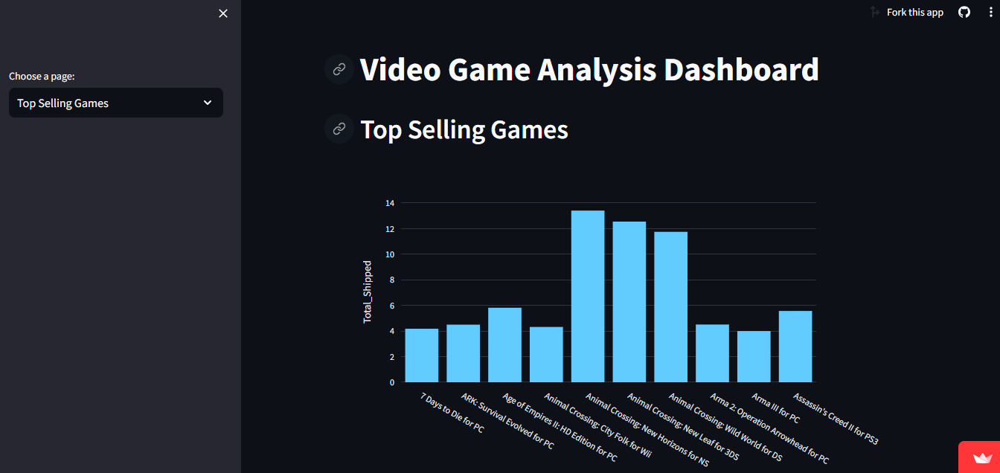

# The Golden Age of Video Games

## Overview
Welcome to "The Golden Age of Video Games" project! This project explores the concept of the "golden age" of video games by analyzing critic and user scores, as well as sales data for the top 400 video games released between 1977 and 2020. Our goal is to uncover insights into the years that stood out in terms of critical acclaim, user satisfaction, and commercial success.

## Dataset
The project utilizes two main tables:
- `game_sales`: Contains information about the top-selling video games, including the game title, platform, publisher, developer, number of copies sold, and release year.
- `game_reviews`: Includes critic and user scores for the games.

## Tasks and Queries
The analysis includes several tasks and corresponding SQL queries, covering aspects such as top-selling games, average critic scores, average user scores, and sales analysis. Each task provides valuable insights into different aspects of the video game industry.

## Conclusion
Based on our analysis, the early 1990s and the years 1998, 2008, and 2002 appear to be potential "golden ages" of video games, as they received high praise from both critics and users and had significant sales figures.

## Game-Scope Streamlit App
In addition to the analysis presented here, we have developed a Streamlit app called "Game-Scope" to provide an interactive platform for exploring the data. The app allows users to visualize and analyze various aspects of video game data, including top-selling games, critic scores, user scores, and sales analysis.

## Access the App
You can access the Game-Scope Streamlit app [here](https://game-scope.streamlit.app/).

## GitHub Repository
Explore the code and contribute to the development of the "The Golden Age of Video Games" project on GitHub: [Project Repository](https://github.com/Mohammed-Mebarek-Mecheter/game-scope).

## Feedback and Contributions
We welcome any feedback or contributions to improve the functionality and user experience of the app and the project overall. Feel free to open issues or pull requests on the GitHub repository.